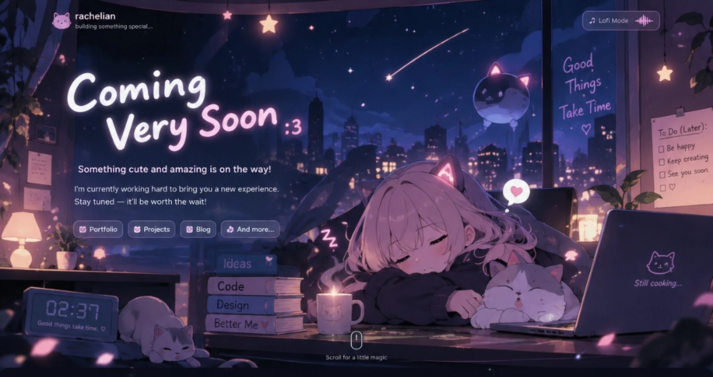

# Rachelian — Coming Very Soon :3

A standalone, cozy, interactive "Coming Very Soon" landing page crafted for **Rachelian**, ready to deploy directly to **Cloudflare Pages** as a static website.



---

## 🌸 Core Concept & Features

Designed to evoke the warm, tranquil feeling of a developer's bedroom at night:
- **Anime & Cozy Aesthetic:** Deep navy, dark purples, soft pinks, lavender, and warm amber highlights.
- **Ultra Lightweight & Framework-Free:** Built with pure semantic HTML5, modern CSS3, and vanilla JavaScript. No React, Next.js, Vue, Tailwind, or heavy runtime libraries.
- **Sub-Second Performance:** Total uncompressed asset footprint under 220 KB (~150 KB with gzip/brotli compression on Cloudflare).
- **Aspect-Ratio Synchronized Canvas:** Mathematical percentage coordinate system guarantees pixel-perfect hotspot alignment across desktop screens (1080p, 1440p, 4K, retina) with responsive mobile adaptation.

### ✨ Interactive Elements
- **Dual-Mode Lofi Radio:**
  - **Dream Synth Mode:** 100% procedural ambient electric piano chord generator built using Web Audio API oscillators, biquad filters, and gentle vinyl warmth. Operates completely offline, requires 0 KB of audio download, and has zero copyright entanglements.
  - **Live Radio Mode:** Verified streaming endpoint for **SomaFM Groove Salad** (commercial-free, listener-supported internet radio broadcasting ambient downtempo with CORS enabled).
  - Includes play/pause toggle, volume slider, interactive animated equalizer bars, and graceful error handling.
- **Real-Time Digital Desk Clock:** Displays the visitor's local device time in glowing retro-digital cyan digits (`HH:MM`) with blinking colon.
- **Clickable Room Objects:**
  - **Left Kitten & Right Cat:** Click to trigger synthesized purr/meow sound effects, floating hearts, and playful speech bubbles.
  - **Steaming Mug:** Click for extra steam bursts and a warm cocoa tooltip.
  - **MacBook Pro:** Click to open the developer terminal easter egg showing compilation status, uptime, and caffeine levels.
  - **Bookshelf:** Click to inspect the reading stack (*Ideas*, *Code*, *Design*, *Better Me ♡*).
  - **Hanging Stars:** Click for crystalline star chimes and sparkle bursts.
  - **To-Do Sticky Note:** Interactive checklist saved persistently in `localStorage`.
- **Atmospheric Visual Effects:**
  - Floating cherry blossom (sakura) petals & stardust particles via lightweight `<canvas>`.
  - Occasional shooting star across the night sky window every 10–18 seconds.
  - Gentle mouse cursor sparkle trail (automatically disabled on touch devices and for users with `prefers-reduced-motion`).
- **Section 2 ("Currently Cooking..."):**
  - Smooth scroll transition to project pillars: **Design**, **Code**, **Systems**, **Creative**.
  - Interactive Daily Cozy Quote roller cycling through cute microcopy.
  - VIP Club email signup stored privately in `localStorage`.

---

## ⌨️ Keyboard Shortcuts

| Shortcut | Action |
| :--- | :--- |
| `Space` | Toggle Lofi Radio Play / Pause |
| `M` | Mute / Unmute audio |
| `C` | Pet the cat :3 |
| `Esc` | Close any active modal or dropdown panel |

---

## 🚀 Cloudflare Pages Deployment

This project is a static site with no backend runtime, database, or server dependencies.

### Option A: Deploy via Cloudflare Dashboard (Recommended)

1. Push this repository to GitHub or GitLab:
   ```bash
   git add .
   git commit -m "feat: complete rachelian coming soon landing page"
   git push origin main
   ```
2. Log into the [Cloudflare Dashboard](https://dash.cloudflare.com/) and navigate to **Workers & Pages** > **Create application** > **Pages** > **Connect to Git**.
3. Select your `Coming-Soon` repository.
4. Configure the build settings:
   - **Framework preset:** `None`
   - **Build command:** *(Leave empty)*
   - **Build output directory:** `.` *(or root directory)*
5. Click **Save and Deploy**. Your site will be live on a `*.pages.dev` subdomain with HTTPS and HTTP/3 enabled automatically!

### Option B: Direct Upload via Wrangler CLI

If you prefer deploying directly from your terminal without connecting Git:

1. Install Wrangler (if not already installed):
   ```bash
   npm install -g wrangler
   ```
2. Authenticate with your Cloudflare account:
   ```bash
   wrangler login
   ```
3. Deploy the current directory to Cloudflare Pages:
   ```bash
   wrangler pages deploy . --project-name=rachelian-coming-soon
   ```

---

## 🛡️ Security & Performance Headers

The included `_headers` file automatically configures Cloudflare Pages with:
- `X-Content-Type-Options: nosniff`
- `X-Frame-Options: DENY`
- `Referrer-Policy: strict-origin-when-cross-origin`
- `Permissions-Policy: microphone=(), camera=(), geolocation=()`
- Long-term immutable caching (`max-age=31536000`) for the optimized WebP scene artwork in `/assets/`.

---

## 🎵 Audio Licensing & Compliance

1. **Procedural Dream Synth:** Synthesized dynamically in real-time within the visitor's browser using the native Web Audio API (`AudioContext`, `OscillatorNode`, `BiquadFilterNode`, `GainNode`). No recorded music, samples, or external assets are used.
2. **SomaFM Groove Salad:** Streamed directly from SomaFM's public icecast endpoint (`https://ice1.somafm.com/groovesalad-128-mp3`). SomaFM is a pioneer of listener-supported, commercial-free non-profit broadcasting, providing open stream URLs with `Access-Control-Allow-Origin: *` for personal and non-commercial streaming. If connectivity fails, the player automatically falls back to the local Dream Synth with a friendly message.

---

## 📄 License

MIT License — feel free to customize and enjoy warmly! ♡
